# Python+Adminlte

---

### 環境建置與啟動

1. 先下載[Adminlte](https://adminlte.io/)
    
    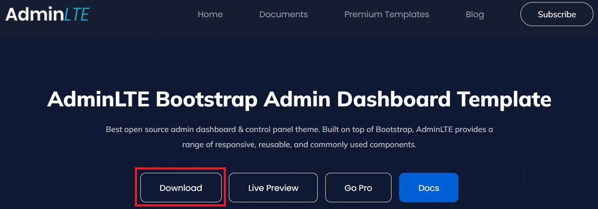
    
2. 下載程式
    
    ```bash
    git clone https://github.com/Ruby-Chu/django-adminlte.git
    ```
    
3. 複製Adminlte內的dist & plugins的資料夾到django-adminlte/myapp/static內

   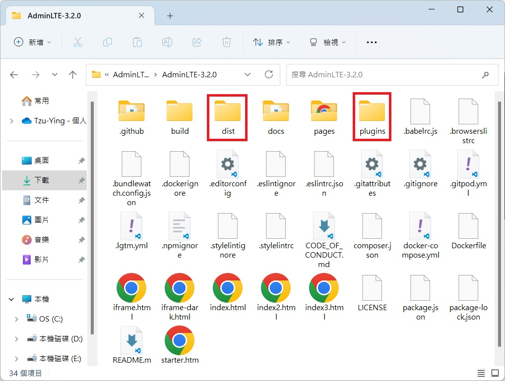

   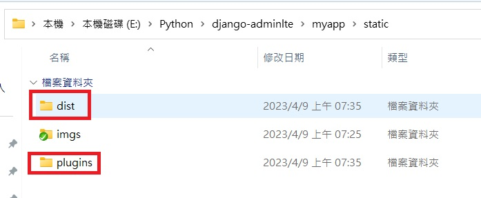

    
4. 建置環境
    - 安裝Anaconda
    - 利用Anaconda Prompt創建新的虛擬環境(myweb)，python 版本為 3.7 以上。
        
        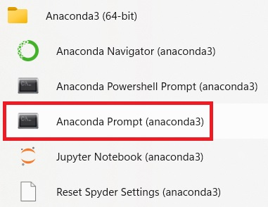
        
        ```bash
        conda create -n myweb python=3.8
        ```
        
    - 進入虛擬環境
        
        ```bash
        conda activate myweb
        ```
        
    - 進入django-admin資料夾，安裝 requirements.txt
        
        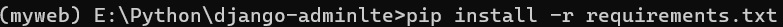
        
        ```bash
        pip install -r requirements.txt
        ```
        
5. 建置基礎資料
    - 建立資料庫: 會自動產生db.sqlite3 sqlite的資料庫
        
        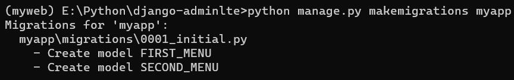
        
        ```bash
        python manage.py makemigrations myapp
        ```
        
    - 建立使用者登入資料庫和登入使用者帳號密碼
        - 建立資料庫
            
            ```bash
            python manage.py migrate
            ```
            
        - 新增帳號密碼
            
            ```bash
            python manage.py createsuperuser
            ```
            
            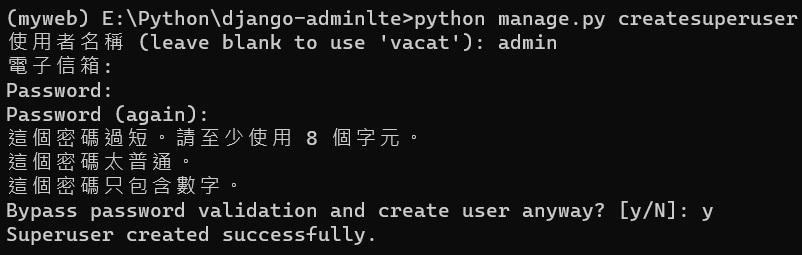
            
6. 建置需要的js & css檔案
    
    ```bash
    python manage.py collectstatic
    ```
    
7. 執行server
    
    ```bash
    python manage.py runserver
    ```
    

### 新增網站

1. 新增需要的網站
    - 進入http://127.0.0.1:8000/admin
        
        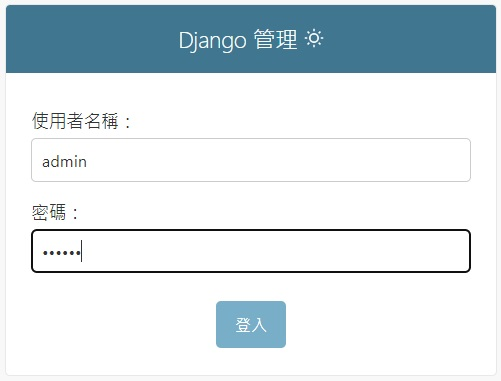
        
        輸入帳號密碼後登入
        
2. 左邊有主選單與次選單

   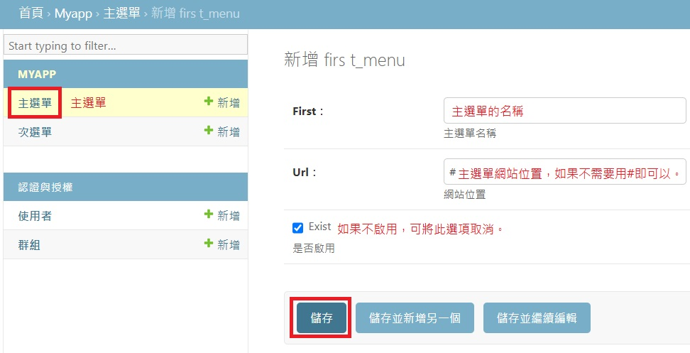

   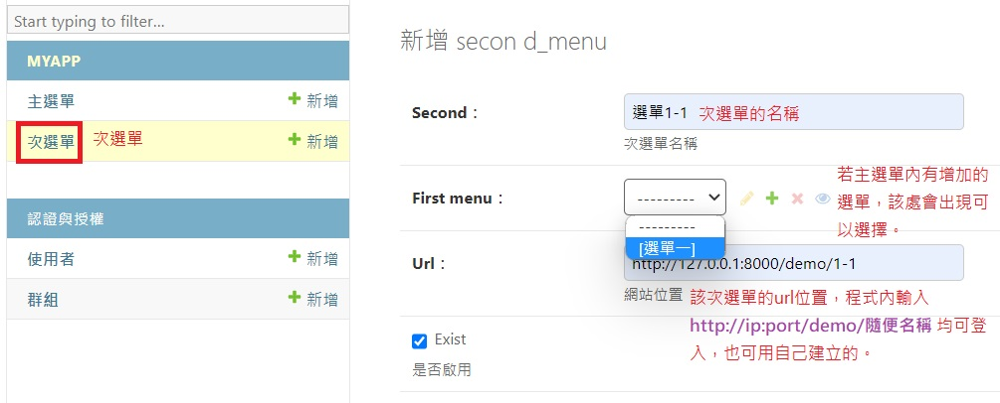

    
3. 進入主要網站
    
    http://127.0.0.1:8000
    
    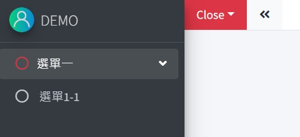
    
    剛剛輸入的選單會出現